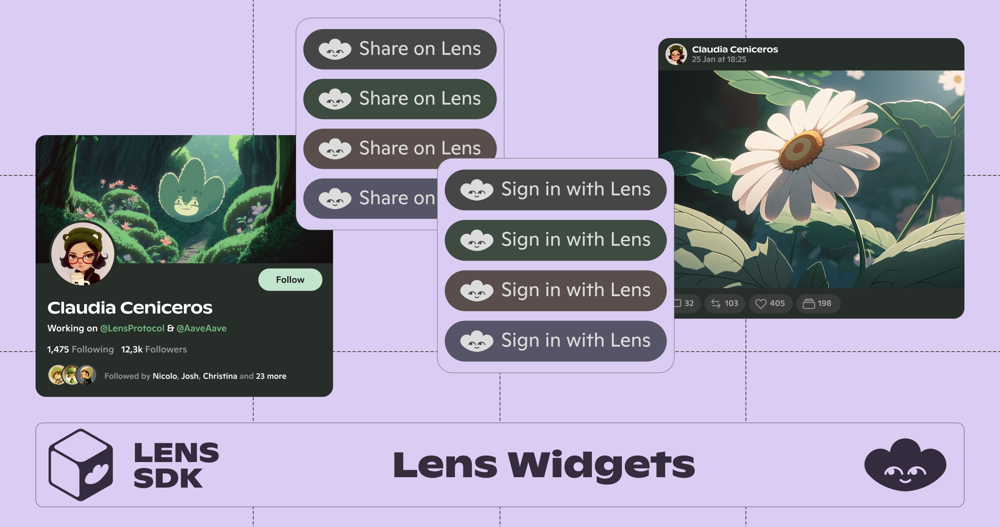

# Lens Widgets

Lens Widgets enable you to easily integrate social features into your app with just a few lines of code.

This was written with `vue-demi` so it should be usable in both Vue2/Vue3.



### Installation

```sh
npm install lens-widgets-vue
```

### Available Components 

- [Share to Lens](#share-to-lens)

### Components To Be Ported
I currently only need the `Share To Lens` button, but will add the other ones as the need comes up.

- [Follow on Lens](#follow-on-lens)
- [Sign in With Lens](#sign-in-with-lens)
- [Profile](#profile)
- [Publication](#publication)
- [Publications](#publications)
- [ProfileListItem](#profilelistitem)

### Share to Lens

```typescript
import {
  ShareToLens, Theme, Size
} from 'lens-widgets-vue'

<ShareToLens
  content="Hello World!"
/>

/* Optional parameters */
url: string = "https://your-awesome-app.com"
hashtags: string = "web3,social,blockchain"
via: string =  "YourAwesomeApp"
title: string = "Share your post on Lens 🌿"
theme: Theme (default, dark, light, mint, green, peach, lavender, blonde)
size: Size (small, medium, large)
containerStyle: styles object
textStyle: styles object
icon: HTML or React element
iconBackgroundColor: string
iconForegroundColor: string
domain: string
```

### Follow on Lens (MISSING)

```typescript
import {
  FollowOnLens, Theme, Size
} from 'lens-widgets-vue'

<FollowOnLens
  handle="stani"
/>

/* Optional parameters */
theme: Theme (default, dark, light, mint, green, peach, lavender, blonde)
size: Size (small, medium, large)
title: string = "Follow me on Lens"
containerStyle: styles object
textStyle: styles object
icon: HTML or React element
iconBackgroundColor: string
iconForegroundColor: string
```

### Sign in With Lens (MISSING)

```typescript
import {
  SignInWithLens, Theme, Size
} from 'lens-widgets-vue'

async function onSignIn(tokens, profile) {
  console.log('tokens: ', tokens)
  console.log('profile: ', profile)
}

<SignInWithLens
  onSignIn={onSignIn}
/>

/* Optional parameters */
provider: Provider
title: string
theme: Theme (default, dark, light, mint, green, peach, lavender, blonde)
size: Size (small, medium, large)
onError: (error) => void
containerStyle: styles object
textStyle: styles object
icon: HTML or React element
iconBackgroundColor: string
iconForegroundColor: string
```

### Profile (MISSING)

```typescript
import {
  Profile, Theme
} from 'lens-widgets-vue'

<Profile
  handle="stani"
/>

/* Optional parameters */
handle: string
ethereumAddress: string
profileId: string
theme: Theme (default, dark)
onClick: () => void
onFollowPress: () => void
containerStyle: {}
followButtonStyle: {}
followButtonContainerStyle: {}
followButtonBackgroundColor: string
followButtonTextColor: string
hideFollowButton: boolean
```

### Publication (MISSING)

```typescript
import {
  Publication, Theme
} from 'lens-widgets-vue'

<Publication
  publicationId="0x9afd-0x02e8"
  theme={Theme.dark}
/>

/* Optional parameters */
theme: Theme (default, dark)
fontSize: string
onClick: () => void
publicationData: Publication
ipfsGateway: string
fontSize: string
```

### Publications (MISSING)

```typescript
import {
  Publications, Theme
} from 'lens-widgets-vue'

<Publications
  handle="nader"
  theme={Theme.dark}
/>

/* Optional parameters */
profileId: string
handle: string
theme: Theme (default, dark)
```

### ProfileListItem (MISSING)

```typescript
import {
  ProfileListItem
} from 'lens-widgets-vue'

<ProfileListItem
  handle="christina"
/>

/* Optional parameters */
profileId: string
handle: string
profile: Profile
theme: Theme (default, dark)
onClick: () => void
onFollowPress: () => void
isFollowing: boolean
containerStyle: {}
followButtonContainerStyle: {}
followButtonStyle: {}
```

### With Nuxt.js

Inside of `nuxt.config.js`, add the package to the `imports` property

```
imports: {
   transform: {
      exclude: [/\blens-widgets-vue\b/]
   }
}
```

Thanks to https://github.com/nuxt/nuxt/issues/18823#issuecomment-1419704343